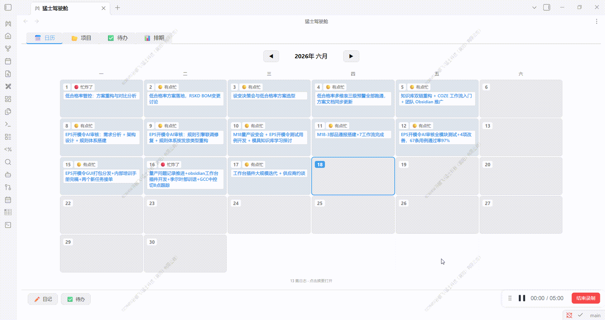
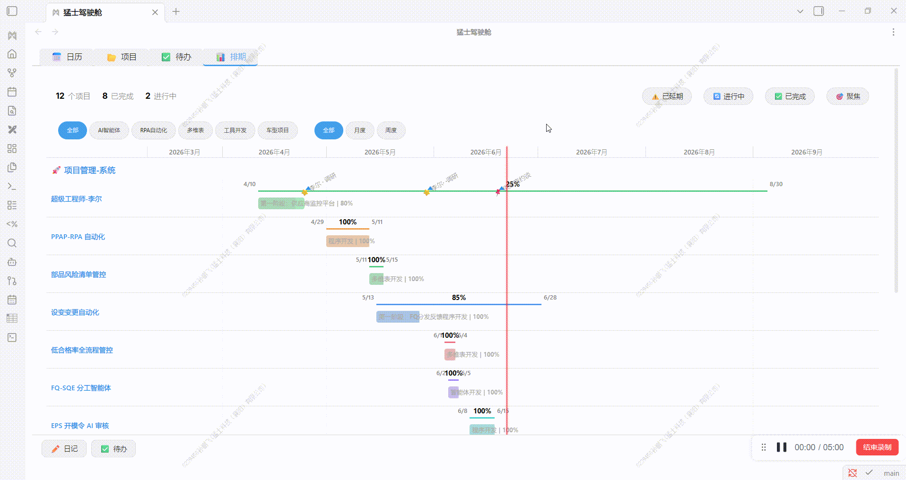

# Mengshi Cockpit

> An all-in-one Obsidian workbench plugin — **Calendar**, **Projects**, **Todos**, **Gantt**, **Feishu (Lark)**, and **Claude Code Sessions** in a single interactive dashboard. (猛士驾驶舱 · 六合一工作台)

[](https://obsidian.md)
[](https://github.com/Spenf710/obsidian-mengshi-cockpit/releases)
[](LICENSE)

---

## Features

| Tab | Name | What it does | Highlights |
|------|------|--------------|------------|
| 📅 | Calendar | Monthly grid with daily summaries and status; click to jump to or create a daily note | Mon–Sat grid, one-click note creation, inline status editing |
| 📂 | Projects | Auto-scan project folders, two-dimensional categorization, card view | Auto-discovers projects, editable tags/categories, maintainable links |
| ✅ | Todos | Aggregates `- [ ]` tasks from multiple sources; checking a box writes back to the source file | Groups by project, collapses completed items, skips template noise |
| 📊 | Gantt | Gantt timeline, drag scheduling, multi-phase, milestones | Today line, phase bars, two-way README sync |
| 📡 | Feishu | Feishu Wiki / Drive browsing, project categorization, link checks, smart meeting notes | Deep scan, auto-categorization, access stats, file moves |
| 💬 | Sessions | Visualize Claude Code sessions, group by project, task workflow | Turn details, title editing, archiving, one-click resume |

> 🖊 **Quick capture**: a bottom FAB offers "Diary / Todo" quick entry (not a separate panel).

---

## Demo

Calendar | Gantt
:---:|:---:
 | 

> Installation demo: see `assets/demo/插件安装.gif`.

---

## Installation

### From Obsidian Community Plugins (recommended)

1. Open Obsidian → **Settings → Community plugins → turn off Restricted mode**
2. Community plugins → Browse → search **Mengshi Cockpit** → Install and enable
3. A shield-shaped icon appears in the ribbon; click it to open the workbench

### Manual install (Release)

1. Download the latest `main.js`, `manifest.json`, `styles.css` from [Releases](https://github.com/Spenf710/obsidian-mengshi-cockpit/releases)
2. Put them into `.obsidian/plugins/mengshi-workbench/` in your vault
3. Settings → Community plugins → Enable

### Build from source

```bash
git clone https://github.com/Spenf710/obsidian-mengshi-cockpit.git
cd obsidian-mengshi-cockpit
npm install
# Build directly into your vault's plugin folder (recommended):
OBSIDIAN_VAULT="C:/path/to/your/vault" npm run build
# Or build to ./dist and copy manually:
npm run build
```

Output directory priority: `OBSIDIAN_VAULT` env var → local `.obsidian` → `./dist`.

---

## Setup

The plugin works **out of the box**, but configure it under **Settings → Mengshi Cockpit** for the best experience:

| Setting | Description | Default |
|---------|-------------|---------|
| Work log folder | Folder for daily notes | Empty → "工作日志" |
| Diary template | Template used for new notes | `templates/工作日志.md` |
| Project roots | Project-type folders (multiple allowed) | Empty → add manually |
| Default categories / tags | Vocabulary for project classification | `通用 / 其他` |
| Tabs | Toggle the 6 tabs independently | All on |

### Feishu (optional)

The Feishu panel relies on the external **lark-cli** tool (install and log in yourself):

```bash
npm install -g @larksuite/cli
lark-cli auth login
```

The plugin auto-detects `lark-cli` (with a `npx` fallback); a guide is shown when it is missing.

### Sessions (optional)

The Sessions panel reads local **Claude Code** session records (`~/.claude/projects/`) — no setup needed. "Loop / Open in Claude" requires the Claude Code CLI; buttons show a hint when it is absent.

---

## Privacy & Data

- Everything is processed locally: it reads your vault's `.md` files, optionally reads `~/.claude/projects` session JSONL, and calls Feishu cloud APIs (via `lark-cli` using your own credentials) only when you open the Feishu panel.
- **Nothing is uploaded to third parties**: Feishu calls only happen when you perform a panel action (browse / search / stats).
- Settings (including personal overrides) are stored in `.obsidian/plugins/mengshi-workbench/data.json`.

---

## Development

```bash
npm run dev    # watch mode + static file sync
npm run build  # production build
```

- Source: `src/main.ts` (plugin shell) + `src/data/*` (data layer) + `src/views/*` (view layer)
- Build: esbuild bundle → `main.js`; standalone `styles.css`; `manifest.json` version aligned with the release tag

### Platform

| Item | Details |
|------|---------|
| Minimum version | Obsidian ≥ 1.7.2 |
| Desktop | ✅ (requires Node runtime; Loop / Sessions / Feishu CLI / Gantt are desktop-first) |
| Mobile | Not published (`isDesktopOnly: true`) |

---

## Credits & License

- The logo is an original military-style creation with no third-party copyright dependencies.
- Released under the [MIT License](LICENSE).

---

## 中文说明

**猛士驾驶舱** 是一款 Obsidian 一体化工作台插件，把 **日历、项目、待办、甘特排期、飞书 (Lark) 云端、Claude Code 会话** 集成到同一个交互面板。

- **安装**：社区插件市场搜索 "Mengshi Cockpit"，或手动下载 Release 产物放入 `.obsidian/plugins/mengshi-workbench/`。
- **构建**：`npm install` → `OBSIDIAN_VAULT=<你的 vault> npm run build`。
- **数据**：全部本地处理；飞书功能需安装 `lark-cli`；会话功能读取本地 `~/.claude/projects`。
- **平台**：Obsidian ≥ 1.7.2，仅桌面端（依赖 Node 运行时）。
- **许可**：MIT。